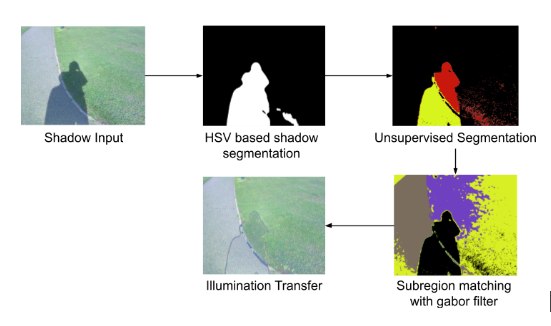

Digital Image processing - NITT course project 

## Shadow detection and removal 

Reimplementation of the paper [Efficient Shadow Removal Using Subregion Matching Illumination Transfer](https://onlinelibrary.wiley.com/doi/full/10.1111/cgf.12250?casa_token=XaNTua352PwAAAAA%3AbThsqn8IUYmAwvGgR0-iVLmKTn8SI0YaYy1APLNI1hbzCpHLyakUAGy1ICcWy4YgvJCD2vvlaMeEH_Zt "Efficient Shadow Removal Using Subregion Matching Illumination Transfer") with a slight twist

Implemented an unsupervised segmentation algorithm employing autoencoders for detection of shadow regions.
Gabor filter is designed to identify the texture features in the images. Illuminance transfer techniques are deployed to remove the shadow regions with the help of the acquired textures.
Implemented the algorithm on SBU Shadow Datasets obtaining good results. More work is needed on the boundary processing of the shadows to improve the accuracy. 

The flow of the shadow detection and removal algorithm

## Reference:
1. [Efficient Shadow Removal Using Subregion Matching Illumination Transfer](https://onlinelibrary.wiley.com/doi/full/10.1111/cgf.12250?casa_token=XaNTua352PwAAAAA%3AbThsqn8IUYmAwvGgR0-iVLmKTn8SI0YaYy1APLNI1hbzCpHLyakUAGy1ICcWy4YgvJCD2vvlaMeEH_Zt "Efficient Shadow Removal Using Subregion Matching Illumination Transfer")
2. [Unsupervised Segmentation](https://github.com/kanezaki/pytorch-unsupervised-segmentation "Unsupervised Segmentation")
