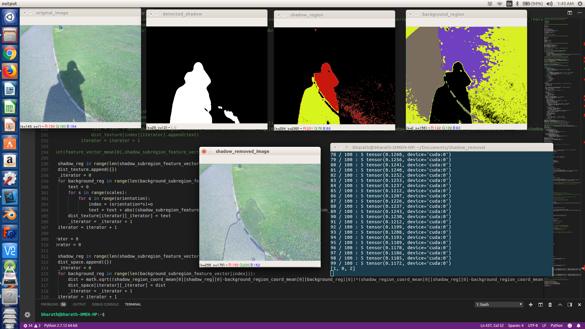

## Shadow detection and removal

##### Implemented an unsupervised segmentation algorithm employing autoencoders for detection of shadow regions.
##### Gabor filter is designed to identify the texture features in the images. Illuminance transfer techniques are deployed to remove the shadow regions with the help of the acquired textures.
##### Implemented the algorithm on Benchmark Shadow Removal Data sets obtaining good results. More work is needed on the boundary processing of the shadows to improve the accuracy. 

##### TODO:
##### 1. Boundary Processing
##### 2. Make the code more efficient
